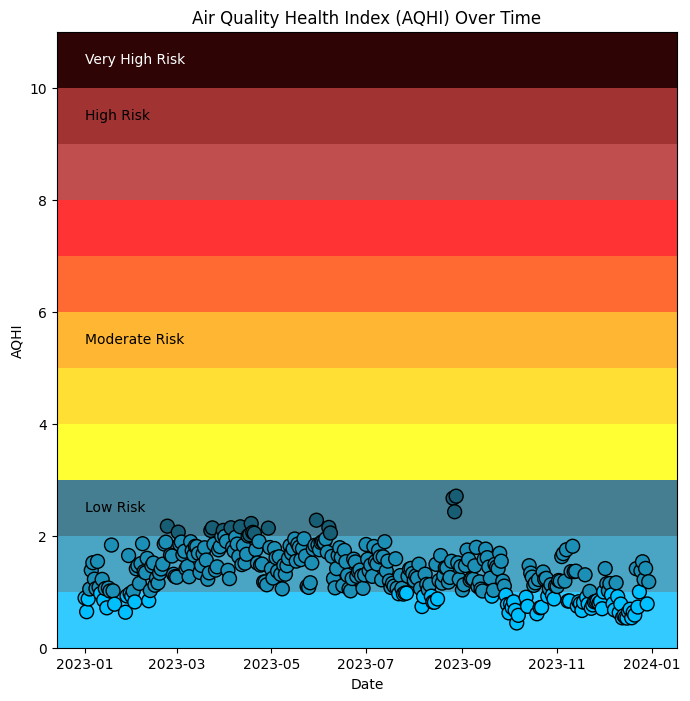
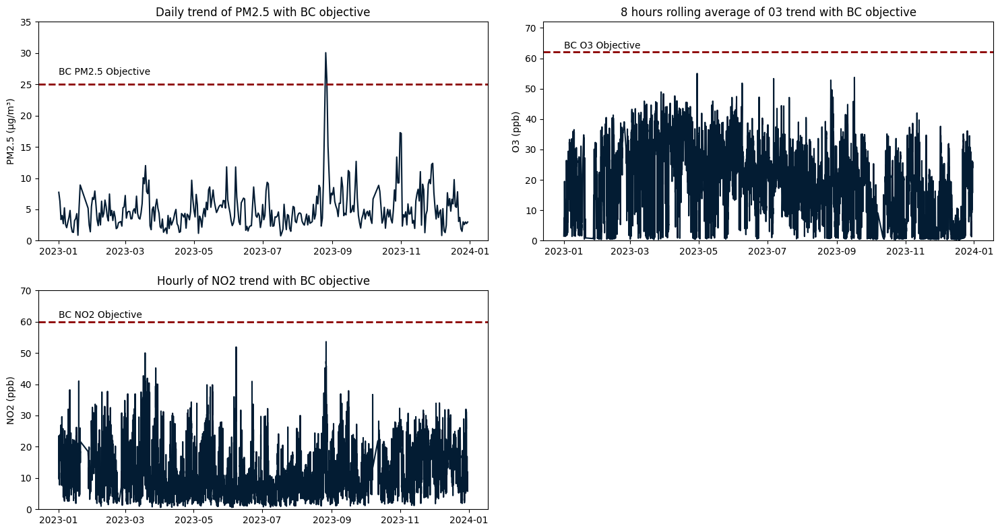

# Air Quality Data Analysis Project
<div style="display:flex;justify-content:center">


</div>

## Overview

This project focuses on the exploration and analysis of air quality data from Vancouver International Airport #2 air quality monitoring station. The objective is to understand air quality monitoring practices, regulatory frameworks, and the impact of local emission sources on air quality. The analysis is conducted using Python and Tableau.

## Objectives

1. Understand the types of air quality monitoring stations and the instruments used.
2. Explore the regulatory frameworks governing air quality monitoring in Vancouver BC.
3. Compare air quality data against local jurisdictional (Vancouver BC) limits and assess compliance.
4. Identify potential local emission sources around the Vancouver International Airport and analyze their impact on air quality trends.

## Project Structure

- `src/`: Helper file.
- `data/`: Directory containing the air quality data files.
- `notebooks/`: Directory containing Jupyter Notebooks for data analysis.
- `README.md`: Project overview and instructions.

## Getting Started

### Prerequisites

- Python 3.x
- Jupyter Notebook

### Setup

1. Clone the repository:

   ```bash
   git clone https://github.com/yourusername/air-quality-analysis.git
   cd air-quality-analysis
   ```
2. Create and activate a virtual environment:

   ```bash
   python3 -m venv env
   source env/bin/activate  # On Windows use `.\env\Scripts\activate`
   ```
3. Install the required packages:

   ```bash
   pip install -r requirements.txt
   ```
4. Start Jupyter Notebook:

   ```bash
   jupyter notebook
   ```
5. Open the notebook `notebooks/Air_Quality_Monitoring_Analysis.ipynb` to begin your analysis.

## Data Analysis

The analysis involves the following steps:

1. **Data Loading and Description**: Load the air quality data and describe its structure.
2. **Statistical Analysis**: Calculate and plot key statistics for primary pollutants (NO2, O3, PM2.5, CO).
3. **Regulatory Comparison**: Compare pollutant statistics with local jurisdictional limits.
4. **Emission Sources Impact**: Investigate local emission sources and their impact on air quality.
5. **Visualization and Interpretation**: Create visualizations and interpret the results.

## Results

The project provides insights into the variations in air quality monitoring practices, compliance with regulatory limits, and the impact of local emission sources. The visualizations and statistical analysis help in understanding the air quality trends in Richmond BC.

## Summary and Conclusion

This analysis evaluates air quality data from the Vancouver International Airport #2 monitoring station, focusing on pollutants such as CO, NO2, O3, and PM2.5. Thorough data-cleaning procedures were applied to ensure accuracy, and statistical analysis revealed significant trends and correlations among the pollutants. For instance, O3 is positively correlated with temperature, with levels peaking during spring, attributed to photochemical reactions facilitated by greater sunlight exposure. CO, NO2, and PM2.5 show strong correlations with each other. Daily patterns highlighted seasonal variations, with CO and NO2 levels peaking during colder months, likely due to increased heating activities and airport operations, coupled with east-southeast winds blowing pollutants into the city.

Comparing the data against the standards set by Province of British Columbia revealed that pollutant levels generally met acceptable limits. However, occasional spikes in PM2.5 exceeded regulatory thresholds. Spatial analysis identified emission sources with high emission rates during these periods, highlighting the impact of wind patterns on pollutant dispersion. This comprehensive analysis underscores the importance of ongoing air quality monitoring and regulatory compliance to protect public health and effectively manage pollution.

## References

1. Air Quality Objectives & Standards - *Province of British Columbia*. (2019). Gov.bc.ca. https://www2.gov.bc.ca/gov/content/environment/air-land-water/air/air-quality-management/regulatory-framework/objectives-standards
2. Canada, Health. (2007). *Air Quality Health Index (AQHI)*. Retrieved from [https://www.canada.ca/en/health-canada/services/air-quality-health-index.html](https://www.canada.ca/en/health-canada/services/air-quality-health-index.html)
3. Dunbar, P., Keyes, L. M., & Browne, J. P. (2023). Determinants of regulatory compliance in health and social care services: A systematic review using the Consolidated Framework for Implementation Research. *PLOS ONE*, 18(4), e0278007. https://doi.org/10.1371/journal.pone.0278007
4. Pyone, T., Smith, H., & van den Broek, N. (2017). Frameworks to assess health systems governance: a systematic review. *Health Policy and Planning*, 32(5), 710–722. https://doi.org/10.1093/heapol/czx007
